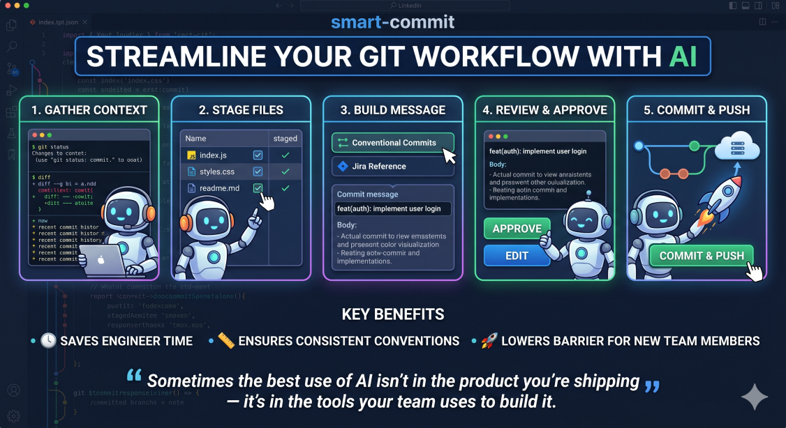

# 📝 Smart Commit



An AI agent skill that stages changes and builds commit messages following your branch's established conventions — with full user review before anything is committed.

## 📦 Installation

Clone this repository (or download the files) and copy the skill into your tool's user-level skills directory.

```bash
git clone https://github.com/nauman73/smart-commit.git
```

### Claude Code

```bash
# Linux / macOS
cp -r smart-commit ~/.claude/skills/smart-commit

# Windows
xcopy smart-commit "%USERPROFILE%\.claude\skills\smart-commit" /E /I
```

Start a new session — the skill is discovered automatically. Invoke it with `/smart-commit` or by asking the agent to commit your changes.

For more details, see the [Claude Code skills documentation](https://platform.claude.com/docs/en/agents-and-tools/agent-skills/overview).

### GitHub Copilot

```bash
# Linux / macOS
cp -r smart-commit ~/.copilot/skills/smart-commit

# Windows
xcopy smart-commit "%USERPROFILE%\.copilot\skills\smart-commit" /E /I
```

Start a new session — Copilot discovers skills automatically and activates them based on your prompt and the skill's description. You can also invoke it with `/smart-commit` in the chat panel.

For more details, see the [GitHub Copilot skills documentation](https://docs.github.com/en/copilot/how-tos/use-copilot-agents/cloud-agent/create-skills).

### Cursor

```bash
# Linux / macOS
cp -r smart-commit ~/.cursor/skills/smart-commit

# Windows
xcopy smart-commit "%USERPROFILE%\.cursor\skills\smart-commit" /E /I
```

Start a new session — Cursor discovers skills automatically and makes them available to the agent. You can also invoke it with `/smart-commit` in the agent chat.

For more details, see the [Cursor skills documentation](https://cursor.com/docs/skills).

### Other tools

If you're using a different AI coding agent, check its documentation for adding custom skills. The core of this skill is the `SKILL.md` file with supporting files in `references/` — most tools that support skills use a similar directory structure.

## 🚀 Quick Start

Invoke the skill in your AI coding tool:

```
/smart-commit
```

Or simply ask the agent to commit your changes — the skill triggers automatically when you mention committing.

### Flags

| Flag | Shorthand | Description |
|------|-----------|-------------|
| `--fresh` | `-f` | Skip preference recall and run through all steps from scratch |
| `--reuse` | `-r` | Auto-accept preference recall and go straight into fast mode. Recalled choices are shown in the Step 4 message review so you still see what's being reused before confirming. |

Examples: `/smart-commit --fresh`, `/smart-commit -r`

## 🔄 Workflow

The skill walks through six sequential steps, pausing for your input at each stage:

| Step | What happens |
|------|-------------|
| **0. Recall preferences** | On repeat invocations, presents previous preferences (staging approach, convention + field values, action) for quick confirmation. Skipped on first run or with `--fresh`. |
| **1. Gather context** | Reads `git status`, `git diff`, and recent commit history |
| **2. Stage files** | Stages modified tracked files, asks about untracked files, then confirms the final file list with you |
| **3. Build message** | Asks you to pick a commit message format, suggests field values based on the diff, then assembles the first line and body |
| **4. Review** | Presents the full commit message for your approval or editing |
| **5. Commit** | Lets you choose **Commit** or **Commit and push**, then executes |

### Fast Mode (Preference Recall)

When you invoke `/smart-commit` a second time in the same session, the skill presents your previous preferences:

```
Previous smart-commit preferences found:
- Staging: tracked files only (untracked files were excluded)
  - Files to commit: src/auth.ts, src/login.ts
- Convention: conventional-commits (type = feat, scope = auth)
- Action: commit and push

Warning: 2 file(s) with changes will NOT be included in this commit:
- config/settings.json
- docs/notes.md

Use same preferences? (Y/N)
```

If any files with changes are excluded by the recalled staging preference, a warning lists them so you can decide whether to proceed or start fresh. Answering **Y** skips all prompts except the message review (Step 4) — the body is always freshly generated from the current diff.

**Skip the Y/N prompt** with `--reuse` (or `-r`) — the skill goes straight into fast mode, and the recalled preferences (plus any excluded-files warning) are shown above the proposed commit message in Step 4 so you still see what's being reused before confirming. Example Step 4 output with `--reuse`:

```
Reusing previous preferences:
- Staging: tracked files only (untracked files were excluded)
  - Files to commit: src/auth.ts, src/login.ts
- Convention: conventional-commits (type = feat, scope = auth)
- Action: commit and push

Proposed commit message:

feat(auth): add JWT login helper

<body text here>
```

Use `--fresh` (or `-f`) to bypass preference recall entirely and start from scratch.

## 📋 Commit Message Conventions

The skill supports reusable commit message conventions stored in `references/conventions/`. Each convention defines a first-line format with named fields that the skill prompts you to fill in.

When asked for field values, the skill **suggests values based on the current diff** (e.g., inferring `type` from the nature of the changes, `scope` from the area of code affected). You can accept the suggestions or provide your own.

### Choosing a Convention

When building the commit message, you can choose from up to four sources:

| Option | Description |
|--------|-------------|
| **(a)** Most recent commit | Reuse the previous commit's first line verbatim |
| **(b)** Saved convention | Pick from your saved conventions and fill in field values |
| **(c)** New convention | Define a new format on the spot — it's saved for future use |
| **(d)** Last used convention | Reuse the convention and field values from the previous `/smart-commit` in this session |

Option **(d)** only appears after you've already used a convention in the current session.

### Built-in Conventions

#### 🏷️ conventional-commits

The [Conventional Commits](https://www.conventionalcommits.org/) standard with optional scope.

- **Format:** `<type>(<scope>)?: <subject>`
- **Example:** `feat(auth): add JWT login`

### ➕ Creating Custom Conventions

When prompted for a commit message format, choose **"Define a new convention"**. The skill will interview you for:

1. A **name** for the convention
2. A **one-line description**
3. An **example first line** or template

The convention is saved to `references/conventions/<name>.md` and appears in the menu on future runs.

## 📂 Directory Structure

```
smart-commit/
├── 📄 SKILL.md                          # Skill definition and full prompt
├── 📄 README.md                         # This file
└── 📁 references/
    └── 📁 conventions/                  # Saved commit message conventions
        └── 📄 conventional-commits.md   # Conventional Commits format
        └── ...                          # Add your own conventions here
```

## 🛡️ Safety Features

- ⛔ Never uses `git add -A` or `git add .` — files are staged explicitly by name
- 🔒 Never stages files that may contain secrets (`.env`, credentials, keys)
- ✋ Never commits without user approval of the message
- 🚫 Never pushes to remote without asking first
- 🔁 Never amends a previous commit unless explicitly asked
- ✅ Never skips pre-commit hooks (`--no-verify`)

## 💡 Tips

- Type **`a`** when asked about the commit format to reuse the most recent commit's first line — great for follow-up commits in the same area.
- Type **`d`** to reuse the last convention and field values from this session — ideal for multiple commits with the same type/scope.
- On repeat commits, just hit **Y** at the preference recall prompt to skip straight to the message review.
- Use `--reuse` (or `-r`) to skip the Y/N prompt entirely — recalled choices are still shown in the Step 4 review, so you stay informed.
- Use `--fresh` (or `-f`) when you want to start clean despite having previous preferences.
- Conventions persist across sessions, so you only define a format once.
- If you have no files to commit, the skill will show you what's available and let you choose before stopping.
